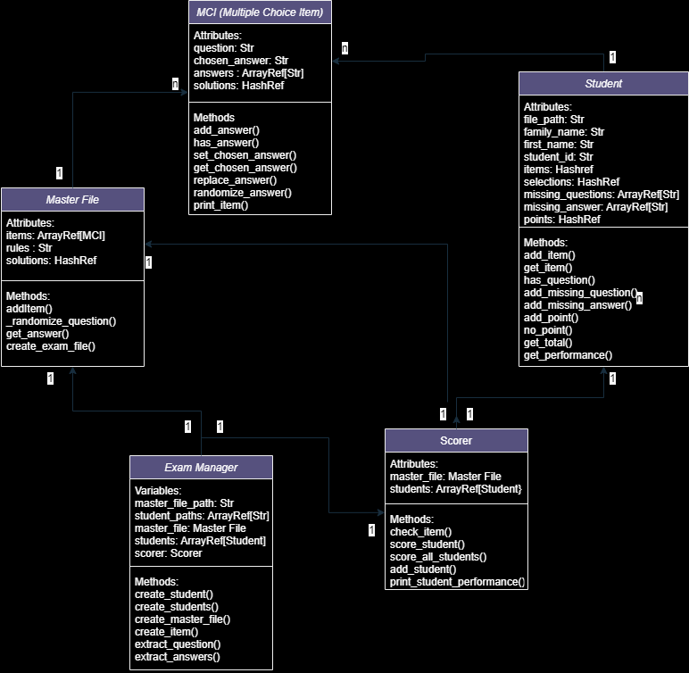

# Introduction to Perl Final Project

## Project Overview
This project is designed to automate the creation and scoring of multiple-choice exams using Perl. The project is split into several tasks and extensions that involve generating randomized exams, grading students' responses and handling edge cases such as incomplete answers.

## Project Structure

### Task 1a: Quick Summary

In Task 1a, the goal is to implement a system that reads multiple-choice questions from a master file, randomizes both the questions and their answers, and generates a new exam file. The `Master_File` class handles this functionality by:
1. Collecting and storing exam items (questions and answers).
2. Randomizing the order of questions and answers using the `_randomize_questions` method.
3. Generating a new exam file with the `create_exam_file` method, ensuring each file has a unique arrangement and is saved with a timestamped filename.

The randomization and exam creation are coordinated through the `Exam_Manager.pl` script.

### Task 1b: Quick Summary

In **Task 1b**, the focus is on scoring student submissions against a master exam file. The relationships between the key classes are as follows:

- **Master_File**: This class contains the correct questions and answers. It serves as the reference for evaluating student responses.
  
- **Student**: Each `Student` object stores the individual student’s answers to the exam questions. It tracks missing or incorrect answers and calculates the student's total score.

- **Scorer**: The `Scorer` class is responsible for comparing each student’s answers to the correct answers in the `Master_File`. It processes each question and answer, updates the student's score, and records any missing or incorrect answers.

### Workflow:
1. **Loading Exam Data**: The `Master_File` is loaded with the correct questions and answers, and each student's answers are stored in corresponding `Student` objects.
2. **Scoring**: The `Scorer` class compares the answers in the `Student` object with those in the `Master_File`. It checks each question, assigns points for correct answers, and records missing or incorrect answers.
3. **Results**: After processing, the `Scorer` generates a performance report for each student, summarizing their score and any discrepancies.

